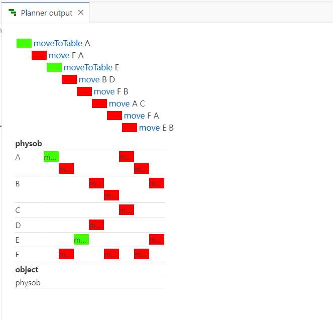
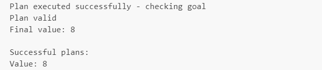
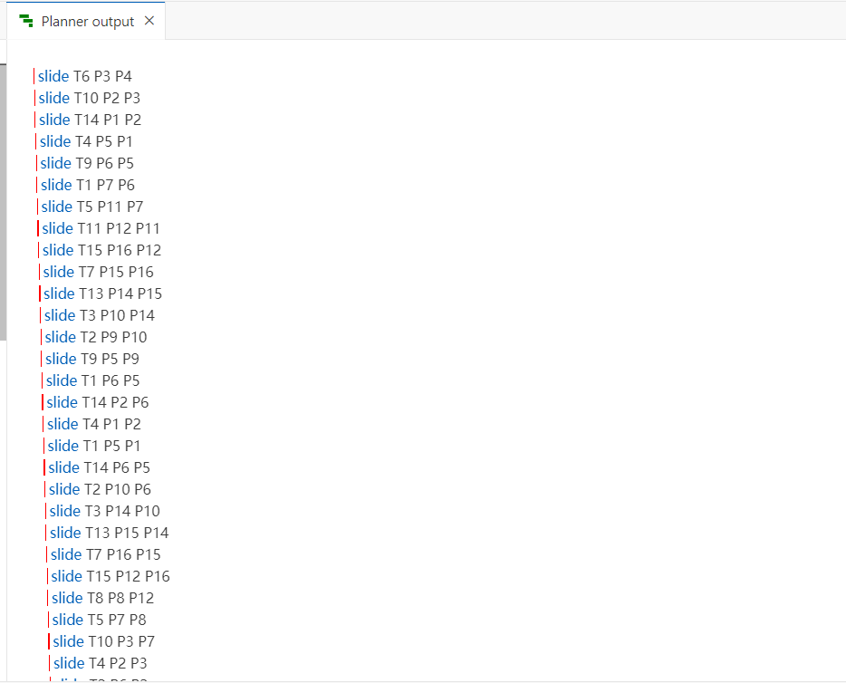
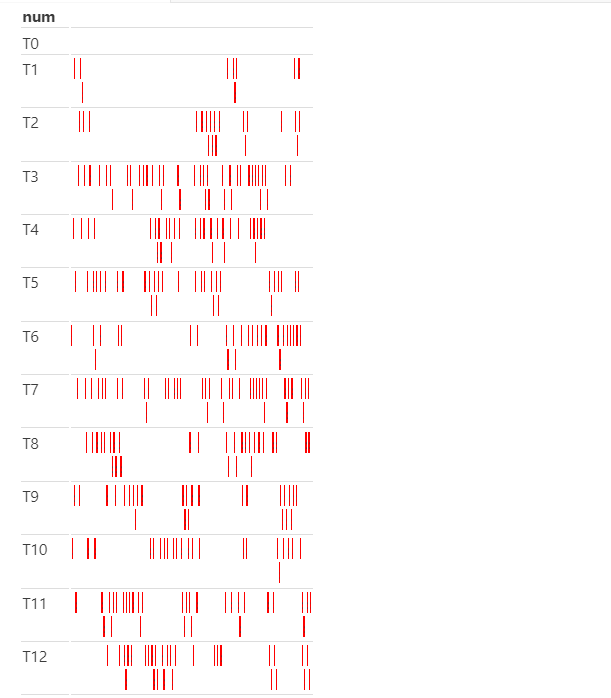
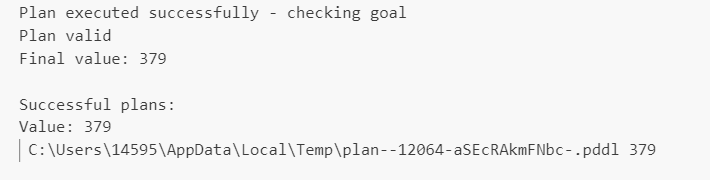

    

         
        
    

         
    

        
    

            
    中山大学计算机学院人工智能
    
实验报告 

     
     
    <table style="border:none;text-align:center;width:72%;font-family:仿宋;font-size:14px; margin: 0 auto;">
    <tbody style="font-family:方正公文仿宋;font-size:12pt;">
        <tr style="font-weight:normal;"> 
            <td style="width:20%;text-align:right;">题　　目</td>
            <td style="width:2%">：</td> 
            <td style="width:40%;font-weight:normal;border-bottom: 1px solid;text-align:center;font-family:华文仿宋"> PDDL实验
</td>     </tr>
        <tr style="font-weight:normal;"> 
            <td style="width:20%;text-align:right;">教学班级</td>
            <td style="width:2%">：</td> 
            <td style="width:40%;font-weight:normal;border-bottom: 1px solid;text-align:center;font-family:华文仿宋">20230349 </td>     </tr>
        <tr style="font-weight:normal;"> 
            <td style="width:20%;text-align:right;">姓　　名</td>
            <td style="width:2%">：</td> 
            <td style="width:40%;font-weight:normal;border-bottom: 1px solid;text-align:center;font-family:华文仿宋"> 张超</td>     </tr>
        <tr style="font-weight:normal;"> 
            <td style="width:20%;text-align:right;">学　　号</td>
            <td style="width:2%">：</td> 
            <td style="width:40%;font-weight:normal;border-bottom: 1px solid;text-align:center;font-family:华文仿宋">22336290 </td>     </tr>
        <tr style="font-weight:normal;"> 
            <td style="width:20%;text-align:right;">专　　业</td>
            <td style="width:2%">：</td> 
            <td style="width:40%;font-weight:normal;border-bottom: 1px solid;text-align:center;font-family:华文仿宋">计算机科学与技术（系统结构） </td>     </tr>
        <tr style="font-weight:normal;"> 
        <tr style="font-weight:normal;"> 
            <td style="width:20%;text-align:right;">日　　期</td>
            <td style="width:2%">：</td> 
            <td style="width:40%;font-weight:normal;border-bottom: 1px solid;text-align:center;font-family:华文仿宋">2024/04/29</td>     </tr>
    </tbody>              
    </table>

<!-- 注释语句：导出PDF时会在这里分页 -->

#  实验题目

利用PDDL完成积木世界和15数码的规划

# 实验内容

## 伪代码

规划的算法的实现由planner完成，所以这里省略推理过程的伪代码\流程图，本实验完成的是论域问题的定义。

需要完成的任务有包括

~~~ pseudocode
domain:
	types,
	predicates,
	constants,
	action
problem:
	objects,
	init,
	goal
~~~

## 算法原理

规划的主要任务是在给定初始状态，可执行动作和目标条件的情况下，设计相应的规划系统，使得当前初始状态通过执行合适的动作序列到达满足目标条件的状态。

## 关键代码展示

与课堂ppt不同的是，pddl文件中的动作没有Del部分，而是在effect中通过添加not实现。

### blocks

~~~ pddl
  (:action move
             :parameters (?x ?y - physob)
             :precondition (and(clear ?x) (clear ?y) (forall (?z - physob)(not(and(on ?x ?z) (on ?y ?z)) )) )
             :effect (and (forall (?z - physob)(when (on ?x ?z) (and(clear ?z)  (not (on ?x ?z)))   )) (not (clear ?y)) (on ?x ?y) )
             )

  (:action moveToTable
             :parameters (?x - physob)
             :precondition (and(clear ?x) (not (ontable ?x)) )
             :effect (and (forall (?z - physob)(when (on ?x ?z) (and(clear ?z) (not(on ?x ?z)))  )) (ontable ?x))
  )
~~~

动作move(x,y):

* 前提：
  * clear ?x：x上方没有积木
  * clear ?y：y上方没有积木
  * forall (?z - physob)(not(and(on ?x ?z) (on ?y ?z)) )：x和y不在同一个积木上方（确保x和y不是同一块积木，避免类似move(A,A)的情况发生）
* 效果：
  * forall (?z - physob)(when (on ?x ?z) (and(clear ?z)  (not (on ?x ?z)))   ))：将x下方的积木z增加谓词clear(z)，说明z此后上方没有积木。删除谓词on(x,z)，说明x此后不在z上方。
  * not (clear ?y)：删除谓词clear(y)，说明伺候y上方有积木
  * on ?x ?y：增加谓词on(x,y)，说明伺候x在y上方

  

动作moveToTable(x):

 * 前提：
   * clear ?x：x上方没有积木
   * not (onTable ?x)：x不在桌面上（x如果已经在桌面上，则没有必要再移动到桌面上）
 * 效果：
   * forall (?z - physob)(when (on ?x ?z) (and(clear ?z) (not(on ?x ?z)))  )：增加谓词clear(z)，说明此后x下方的积木z上方没有积木。删除谓词on(x,z)，说明此后x不在z上方。
   * onTable ?x：增加谓词onTable(x)，说明此后x在桌面上。

### pullze

#### domain

~~~ pddl
(define (domain puzzle)
  (:requirements :strips :equality:typing)
  (:types num loc) 
  (:predicates
    (adjacent ?x - loc ?y - loc)
    (at ?x - num ?y - loc)
    )
  (:constants
    T0 - num
  )
  (:action slide
             :parameters (?t - num ?x ?y - loc)
             :precondition (and(at ?t ?x) (at T0 ?y) (adjacent ?x ?y))
             :effect (and (at ?t ?y) (at T0 ?x) (not (at ?t ?x)) (not (at T0 ?y))) 
  )
)
~~~

类型：

* num：某个位置上的数字 (0-15)
* loc：pullze中的某个位置（1-16)

谓词：

* adjacent(x,y)：表示位置x和y相邻
* at(x,y)：表示位置y处的数字为x

常量：

* T0：代表数字0，表示pullze中的空格位置

动作slide(t,x,y):

* 前提：
  * at ?t ?x：数字t在位置x上
  * at T0 ?y：空格在位置y处
  * adjacent ?x ?y：位置x和y相邻
* 效果：
  * at ?t ?y：增加谓词at(t,y)，说明此后y位置的数字为t
  * at T0 ?x：增加谓词at(T0,x)，说明此后x处为空格
  * not (at ?t ?x)：删除谓词at(t,x)，说明此后x处的数字不为t
  * not (at T0 ?y)：删除谓词at(T0,y)，说明此后位置y不为空格

#### problem

以ppt1.pddl为例，其他几个pptX.pddl类似，修改一下初始状态即可：

~~~ pddl
(define (problem PPT1)
 (:domain puzzle)
 (:objects 
    T1 T2 T3 T4 T5 T6 T7 T8 T9 T10 T11 T12 T13 T14 T15 - num
    P1 P2 P3 P4 P5 P6 P7 P8 P9 P10 P11 P12 P13 P14 P15 P16 - loc
 )
 (:init
    (at T14 P1) (at T10 P2) (at T6 P3) (at T0 P4) (at T4 P5) (at T9 P6) (at T1 P7) (at T8 P8)
    (at T2 P9) (at T3 P10) (at T5 P11) (at T11 P12) (at T12 P13) (at T13 P14) (at T7 P15) (at T15 P16)
    (adjacent P1 P2) (adjacent P1 P5)
    (adjacent P2 P1) (adjacent P2 P3) (adjacent P2 P6)
    (adjacent P3 P2) (adjacent P3 P7) (adjacent P3 P4)
    (adjacent P4 P3) (adjacent P4 P8)
    (adjacent P5 P6) (adjacent P5 P1) (adjacent P5 P9)
    (adjacent P6 P5) (adjacent P6 P10) (adjacent P6 P7) (adjacent P6 P2)
    (adjacent P7 P6) (adjacent P7 P11) (adjacent P7 P8) (adjacent P7 P3)
    (adjacent P8 P7) (adjacent P8 P12) (adjacent P8 P4)
    (adjacent P9 P13) (adjacent P9 P10) (adjacent P9 P5) 
    (adjacent P10 P9) (adjacent P10 P14) (adjacent P10 P11) (adjacent P10 P6)
    (adjacent P11 P10) (adjacent P11 P15) (adjacent P11 P12) (adjacent P11 P7)
    (adjacent P12 P11) (adjacent P12 P16) (adjacent P12 P8)
    (adjacent P13 P14) (adjacent P13 P9) 
    (adjacent P14 P13) (adjacent P14 P15) (adjacent P14 P10)
    (adjacent P15 P14) (adjacent P15 P16) (adjacent P15 P11)
    (adjacent P16 P15) (adjacent P16 P12)
    )
 
 (:goal 
    (and(at T1 P1) (at T2 P2) (at T3 P3) (at T4 P4) (at T5 P5) (at T6 P6) (at T7 P7) (at T8 P8) (at T9 P9)
    (at T10 P10) (at T11 P11) (at T12 P12) (at T13 P13) (at T14 P14) (at T15 P15))
 )
)
; 14 10 6 0
; 4 9 1 8
; 2 3 5 11
; 12 13 7 15
~~~

对象：

* T1-T15：表示数字1-16(注意T0为常量，表示空格)
* P1-P16：表示位置1-16

初始化状态：

* at：把数字放在对应位置上
* adjacent：把相邻的位置正确设置

目标：

* 把数字和位置一一对应

# 实验结果展示

## blocks

经过检验可知，该序列确实可以达到目标状态。

## pullze

仍然以ppt1.pddl的实验结果为例（部分截图），剩下的放在./result文件夹中。

经过检验可知，该序列确实可以达到目标状态。

