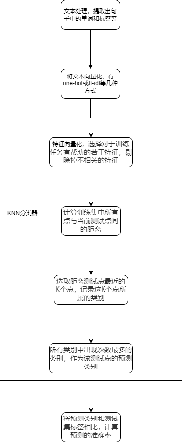
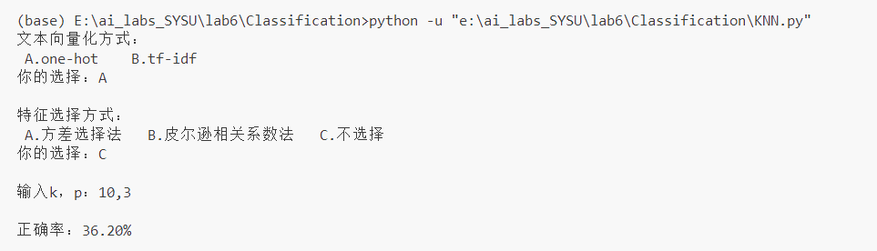

    

         
        
    

         
    

        
    

            
    中山大学计算机学院人工智能
    
实验报告 

     
     
    <table style="border:none;text-align:center;width:72%;font-family:仿宋;font-size:14px; margin: 0 auto;">
    <tbody style="font-family:方正公文仿宋;font-size:12pt;">
        <tr style="font-weight:normal;"> 
            <td style="width:20%;text-align:right;">题　　目</td>
            <td style="width:2%">：</td> 
            <td style="width:40%;font-weight:normal;border-bottom: 1px solid;text-align:center;font-family:华文仿宋"> 文本情感分类
</td>     </tr>
        <tr style="font-weight:normal;"> 
            <td style="width:20%;text-align:right;">教学班级</td>
            <td style="width:2%">：</td> 
            <td style="width:40%;font-weight:normal;border-bottom: 1px solid;text-align:center;font-family:华文仿宋">20230349 </td>     </tr>
        <tr style="font-weight:normal;"> 
            <td style="width:20%;text-align:right;">姓　　名</td>
            <td style="width:2%">：</td> 
            <td style="width:40%;font-weight:normal;border-bottom: 1px solid;text-align:center;font-family:华文仿宋"> 张超</td>     </tr>
        <tr style="font-weight:normal;"> 
            <td style="width:20%;text-align:right;">学　　号</td>
            <td style="width:2%">：</td> 
            <td style="width:40%;font-weight:normal;border-bottom: 1px solid;text-align:center;font-family:华文仿宋">22336290 </td>     </tr>
        <tr style="font-weight:normal;"> 
            <td style="width:20%;text-align:right;">专　　业</td>
            <td style="width:2%">：</td> 
            <td style="width:40%;font-weight:normal;border-bottom: 1px solid;text-align:center;font-family:华文仿宋">计算机科学与技术（系统结构） </td>     </tr>
        <tr style="font-weight:normal;"> 
        <tr style="font-weight:normal;"> 
            <td style="width:20%;text-align:right;">日　　期</td>
            <td style="width:2%">：</td> 
            <td style="width:40%;font-weight:normal;border-bottom: 1px solid;text-align:center;font-family:华文仿宋">2024/05/07</td>     </tr>
    </tbody>              
    </table>

<!-- 注释语句：导出PDF时会在这里分页 -->

#  实验题目

在给定文本数据集完成文本情感分类训练，在测试集完成测试，计算准确率。

我选择使用K-NN分类器完成本次实验

# 实验内容

## 算法原理

K-NN（K-最近邻）分类器是一种简单但有效的监督学习算法，通常用于分类和回归任务。它不基于显式的训练阶段，而是通过与训练数据中的样本进行比较来进行预测。以下是K-NN分类器的基本原理和步骤：

1. **定义K**：首先，你需要定义一个参数K，表示在预测时要考虑的最近邻居的数量。K是一个正整数，通常选择奇数以避免平局的情况。
2. **计算距离**：在预测一个新的数据点的类别时，首先计算该数据点与所有训练数据点之间的距离。常用的距离度量包括欧几里得距离、曼哈顿距离和闵可夫斯基距离等。
3. **寻找K个最近邻**：在计算完所有距离后，按照距离的大小对训练数据点进行排序，然后选取距离最小的K个数据点。
4. **进行投票**：对于分类任务，使用K个最近邻的数据点的类别来进行投票，类别得票最多的就是预测的结果。
5. **输出预测结果**：通过投票得出的类别就是对新数据点的预测结果。对于回归任务，K-NN通常使用K个最近邻的平均值来作为预测结果。

## 流程图

## 关键代码展示

### 文本向量化

* one-hot

  ~~~python
  # 输入句子和所有不同的单词
  # 返回特征向量(矩阵)
  def boolCountVectorizer(lines,diff_words):
      lines_num = len(lines)
      words_num = len(diff_words)
      mat = np.zeros((lines_num,words_num),dtype=int) #将矩阵初始化为0
      word_index = {}
      for i in range(words_num):
          word_index[diff_words[i]] = i #提前记录每个单词在单词列表中的下标
      for i in range(lines_num):
          for j in range(len(lines[i])):
              if lines[i][j] in diff_words:
                  index = word_index[lines[i][j]]
                  mat[i][index] = 1       #将文本中出现的单词在矩阵对应位置设置为1
      return mat
  ~~~

* tf-idf

  ~~~python
  # 输入句子和所有不同的单词
  # 返回特征向量(矩阵)
  def tf_idfVectorizer(lines,diff_words):
      lines_num = len(lines)
      words_num = len(diff_words)
      mat = np.zeros((lines_num,words_num),dtype=int)
      for i,word in enumerate(diff_words):
          n = 0 # 记录包含word的文档数
          for j in range(lines_num):
              if word in lines[j]:
                  n += 1
          idf = math.log((lines_num)/(n+1))
          for j in range(lines_num):
              t = lines[j].count(word)
              tf = t/len(lines[j])   #第j个句子中的tf，即出现频率
              mat[j][i] = tf*idf  #表示第i个词在第j个句子中的tf-idf权重
      return mat
  ~~~

  

### 特征选择

* 方差选择法

  如果向量化文本是用的one-hot的方式，则可以把特征矩阵的每个元素看作伯努利随机变量。

  如果矩阵中的某一列向量大多数全是0或者全是1，则这个特征对标签的影响是非常小的，我们可以把这个特征剔除。

  我们可以用方差来刻画列向量中0和1的分布情况，对于多个伯努利随机变量组成的二项分布的方差计算公式为$p(1-p),$比如我们想要剔除掉80%的概率为1或0的情况，我们就应该剔除掉方差小于0.8*0.2，即方差小于0.16的特征。

  代码如下：

  ~~~python
  # 输入为特征矩阵，概率，和单词
  # 输出为剔除不相关特征后的矩阵，单词
  def featureSupport(mat,p,diff_words):
      var = p*(1-p) 
      columns_var = np.var(mat,axis=0) #计算每列的方差
      #print(columns_var)
      mu = columns_var >= var #得到一个全是bool值的向量
      return mat[:,mu],diff_words[mu] 
  ~~~

* 皮尔逊相关系数法

  皮尔逊相关系数显示了两个随机变量之间的线性相关性。

  我们可以用它来表示某一特征向量与标签之间的线性相关性，若它们之间的线性相关性很小，则这一特征对标签的影响可能很大很小，可以剔除该特征。

  皮尔逊相关系数的计算公式如下：
  $$
  \rho_{x,y} = \frac{Cov(X,Y)}{\sigma_X\sigma_Y}
  $$
  代码如下：

  ~~~python
  # 输入为特征矩阵，相关系数，和单词
  # 输出为剔除不相关特征后的矩阵，单词
  def featureSupport1(mat,p,diff_words,train_labels):
      lst=[scipy.stats.pearsonr(mat[:,i],train_labels.T)[0] for i in range(mat.shape[1])] #调库计算皮尔逊相关系数
      mu=np.abs(np.array(lst))>=p  #得到一个全是bool值的向量（False表示被剔除的特征）
      return mat[:,mu],diff_words[mu]
  ~~~

### KNN分类器

~~~ python
def KNN(train_mat,train_labels,test_mat,test_labels,k,p):
    train_num = train_mat.shape[0]
    test_num = test_mat.shape[0]
    pred_true = 0
    for i in range(test_num):
        distances = [np.sum((train_mat[j]-test_mat[i])**p) for j in range(train_num)]
        #distances = [num**(1/p) for num in distances] #省略此步，因为只需要排序，而不需要具体距离
        distances = np.array(distances) #得到距离的向量
        nearest = distances.argsort() #nearest是排序后的下标
        top_k = [train_labels[index] for index in nearest[:k]]  #得到前k个类别
        pred = np.argmax(np.bincount(np.array(top_k))) #topk类别中最大的一个类别
        if pred == test_labels[i]:
            pred_true+=1 #预测正确
    return pred_true
~~~

## 创新点

**特征选择**：加入了特征选择这一步骤，将与标签相关性较高的标签保留下来，删去相关性低的标签，能减少这些相关性低的特征的对预测标签的影响，可能会提高正确率

# 实验结果展示及分析

## 实验结果展示

## 实验指标分析

| 文本向量化 | 特征选择 | k    | p    | 正确率 |
| ---------- | -------- | ---- | ---- | ------ |
| one-hot    | 不选择   | 5    | 2    | 28.90% |
| one-hot    | 不选择   | 10    | 2    | 32.70% |
| one-hot    | 不选择   | 15    | 2    | 31.60% |
| one-hot    | 不选择   | 5    | 3    | 36.20% |
| one-hot    | 不选择   | 10    | 3    | 36.20% |
| one-hot    | 不选择   | 15    | 3    | 36.20% |
| one-hot    | 不选择   | 5    | 5    | 36.20% |
| one-hot    | 不选择   | 10    | 5    | 36.20% |
| one-hot    | 不选择   | 15    | 5    | 36.20% |

可以看到有多组k，p的取值可以达到较高正确率，我们任意选择一组，比如（10，3）。我们控制k，p，继续测试可能影响正确率的因素。

| 文本向量化 | 特征选择 | k    | p    | 正确率 |
| ---------- | -------- | ---- | ---- | ------ |
| one-hot    | 相关系数法（概率0.9）   | 10    | 3    | 16.00% |
| one-hot    | 相关系数法（概率0.95）   | 10    | 3    | 16.00% |
| one-hot    | 皮尔逊相关系数法（相关系数0.2)   | 10    | 3    | 16.00% |
| one-hot    | 皮尔逊相关系数法（相关系数0.1)   | 10    | 3    | 36.20% |
| tf-idf    | 皮尔逊相关系数法（相关系数0.2)   | 10    | 3    | 16.00% |
| tf-idf    | 皮尔逊相关系数法（相关系数0.1)   | 10    | 3    | 35.20% |

可以看到使用one-hot的文本向量化方式和不使用特征选择可以达到较高的正确率。
综合以上测试，最高正确率达到36.20%

