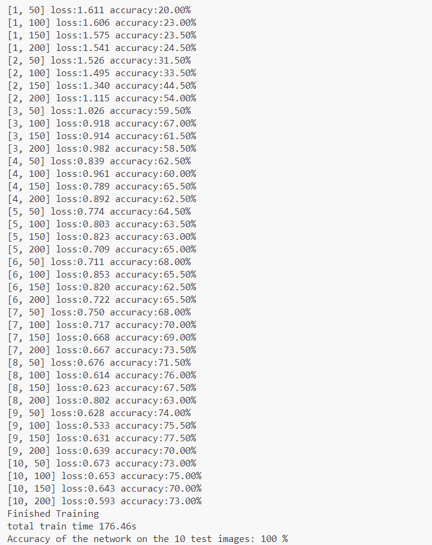
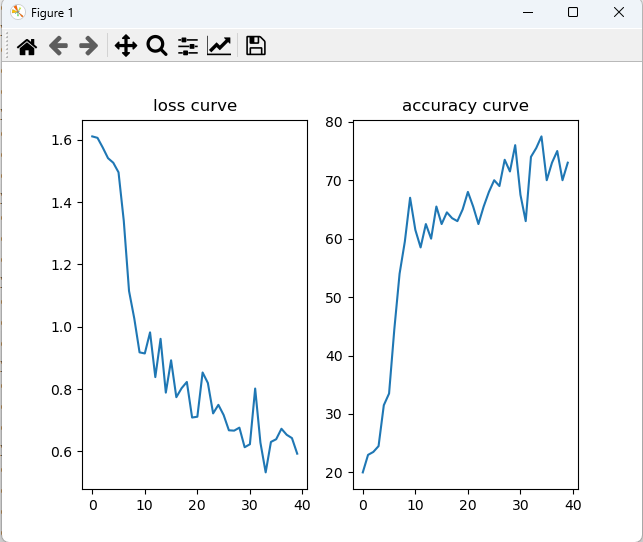

    

         
        
    

         
    

        
    

            
    中山大学计算机学院人工智能
    
实验报告 

     
     
    <table style="border:none;text-align:center;width:72%;font-family:仿宋;font-size:14px; margin: 0 auto;">
    <tbody style="font-family:方正公文仿宋;font-size:12pt;">
        <tr style="font-weight:normal;"> 
            <td style="width:20%;text-align:right;">题　　目</td>
            <td style="width:2%">：</td> 
            <td style="width:40%;font-weight:normal;border-bottom: 1px solid;text-align:center;font-family:华文仿宋"> 中药图片分类任务
</td>     </tr>
        <tr style="font-weight:normal;"> 
            <td style="width:20%;text-align:right;">教学班级</td>
            <td style="width:2%">：</td> 
            <td style="width:40%;font-weight:normal;border-bottom: 1px solid;text-align:center;font-family:华文仿宋">20230349 </td>     </tr>
        <tr style="font-weight:normal;"> 
            <td style="width:20%;text-align:right;">姓　　名</td>
            <td style="width:2%">：</td> 
            <td style="width:40%;font-weight:normal;border-bottom: 1px solid;text-align:center;font-family:华文仿宋"> 张超</td>     </tr>
        <tr style="font-weight:normal;"> 
            <td style="width:20%;text-align:right;">学　　号</td>
            <td style="width:2%">：</td> 
            <td style="width:40%;font-weight:normal;border-bottom: 1px solid;text-align:center;font-family:华文仿宋">22336290 </td>     </tr>
        <tr style="font-weight:normal;"> 
            <td style="width:20%;text-align:right;">专　　业</td>
            <td style="width:2%">：</td> 
            <td style="width:40%;font-weight:normal;border-bottom: 1px solid;text-align:center;font-family:华文仿宋">计算机科学与技术（系统结构） </td>     </tr>
        <tr style="font-weight:normal;"> 
        <tr style="font-weight:normal;"> 
            <td style="width:20%;text-align:right;">日　　期</td>
            <td style="width:2%">：</td> 
            <td style="width:40%;font-weight:normal;border-bottom: 1px solid;text-align:center;font-family:华文仿宋">2024/05/21</td>     </tr>
    </tbody>              
    </table>

<!-- 注释语句：导出PDF时会在这里分页 -->

#  实验题目

利用pytorch框架搭建神经网络实现中药图片分类，具体见给出的数据集和测试集。

# 实验内容

## 算法原理

卷积神经网络是一种深度学习模型，特别擅长处理图像数据。它的算法原理主要包括以下几个关键部分：

### 卷积层

卷积层是CNN的核心组件，用于提取图像的局部特征。卷积操作通过一个小的滤波器在输入图像上滑动，进行点积运算，生成特征图（feature map）。这种操作的优势在于它可以捕捉到图像中的局部模式，例如边缘、角点等。

- **参数共享**：每个滤波器的参数在整个图像上共享，使得模型参数大大减少。

### 激活函数

卷积操作后的输出通常通过非线性激活函数进行处理。激活函数引入非线性计算，使得模型能更好的拟合复杂数据。

### 池化层

池化层用于对特征图进行下采样，减少数据量和计算量，同时保留主要特征。

### 全连接层

在网络的最后，通常会有一个或多个全连接层，它们将前面提取的特征整合起来，用于分类或回归任务。全连接层的每个神经元与前一层的所有神经元相连，进行线性组合并通过激活函数。

### 损失函数和优化器

CNN通过定义损失函数（如交叉熵损失用于分类任务）来衡量预测值与真实值的差距。然后使用反向传播算法和优化算法（如梯度下降）来调整模型参数，最小化损失函数。

- **反向传播**：通过计算损失函数对各层参数的梯度，逐层更新参数。
- **梯度下降**：通过调整权重，逐步减少损失函数值，常用的变种有随机梯度下降（SGD）、Adam等。

## 流程图

### 中药图片分类总体框架

### 网络模型构建

| 网络层号 | 网络层类型 | 网络层具体参数                                               |
| -------- | ---------- | ------------------------------------------------------------ |
| 1        | 卷积层     | 输入通道数为3，输出通道数为32，卷积核大小为5×5，步长为1，填充为2 |
| 2        | 最大池化层 | 池化窗口大小为2×2                                            |
| 3        | 卷积层     | 输入通道数为32，输出通道数为32，卷积核大小为5×5，步长为1，填充为2 |
| 4        | 最大池化层 | 池化窗口大小为2×2                                            |
| 5        | 卷积层     | 输入通道数为32，输出通道数为64，卷积核大小为5×5，步长为1，填充为2 |
| 6        | 最大池化层 | 池化窗口大小为2×2                                            |
| 7        | flatten层  | 把多维的数据一维化，处理后的向量长度为64×40×40               |
| 8        | 全连接层   | 输入样本大小为64×40×40，输出的样本大小为640，带有dropout正则化，概率为0.5 |
| 9        | 全连接层   | 输入样本大小为640，输出的样本大小为5                         |

### 训练过程

## 关键代码展示

###  数据处理

~~~python
def data_process(batch_size):
    #训练时做数据增强
    train_transform = transforms.Compose([transforms.Resize((320,320)), #固定图片尺寸
                                          transforms.RandomHorizontalFlip(),# 随机将图片水平翻转
                                          transforms.RandomRotation(15),# 随机旋转图片 (-15,15)
                                          transforms.ToTensor(),
                                          transforms.Normalize((0.5,0.5,0.5),(0.5,0.5,0.5))])
    #测试时不需要数据增强
    test_transform = transforms.Compose([transforms.Resize((320,320)),
                                         transforms.ToTensor(),
                                         transforms.Normalize((0.5,0.5,0.5),(0.5,0.5,0.5))])
    train_data = torchvision.datasets.ImageFolder("train",transform=train_transform) # 加载数据集
    test_data = torchvision.datasets.ImageFolder("test",transform=test_transform)
    train_data_loader = torch.utils.data.DataLoader(dataset = train_data,batch_size=batch_size, shuffle=True) #划分为mini-batch
    test_data_loader = torch.utils.data.DataLoader(dataset=test_data,batch_size=batch_size)
    return train_data_loader,test_data_loader
~~~

### 模型构建

根据“流程图”中的网络模型结构构建出CNN模型

~~~python
class CNNnet(nn.Module):
    def __init__(self) -> None:
        super().__init__()
        # 模型各层定义
        self.conv1 = nn.Conv2d(in_channels=3,out_channels=32,kernel_size=5,stride=1,padding=2)
        self.pool1 = nn.MaxPool2d(kernel_size=2)
        self.conv2 = nn.Conv2d(in_channels=32,out_channels=32,kernel_size=5,stride=1,padding=2)
        self.pool2 = nn.MaxPool2d(kernel_size=2)
        self.conv3 = nn.Conv2d(in_channels=32,out_channels=64,kernel_size=5,stride=1,padding=2)
        self.pool3 = nn.MaxPool2d(kernel_size= 2)
        self.fc1 = nn.Linear(64*40*40,640)
        self.fc2 = nn.Linear(640,5)
    # 前向传播函数
    def forward(self,x):
        x = self.pool1(nn.functional.relu(self.conv1(x)))
        x = self.pool2(nn.functional.relu(self.conv2(x)))
        x = self.pool3(nn.functional.relu(self.conv3(x)))
        x = x.view(-1,64*40*40)
        x = nn.functional.relu(self.fc1(x))
        x = nn.functional.dropout(x)
        x = nn.functional.relu(self.fc2(x))
        return x
~~~

### 模型训练

~~~ python
def train(train_data_loader,lr):
    criterion = nn.CrossEntropyLoss() #损失函数
    optimizer = torch.optim.SGD(net.parameters(),lr=lr,momentum=0.9) #优化器
    ## 训练模型
    for epoch in range(10):
        running_loss = 0.0
        accuracy = 0.0
        # 迭代，批次训练
        for i, data in enumerate(train_data_loader):
            # 获取训练数据
            inputs, labels = data
            inputs, labels = inputs.to(device), labels.to(device)
            # 权重参数梯度清零
            optimizer.zero_grad()  
            # 正向传播
            outputs = net(inputs)
            # 计算损失值
            loss = criterion(outputs, labels)
            # 计算准确率
            _, predicted = torch.max(outputs.data, 1)
            accuracy += (predicted == labels).sum().item()
            # 反向传播
            loss.backward()
            # 参数更新
            optimizer.step()
            # 损失值累加
            running_loss += loss.item()
            # 每50个mini-batch显示一次损失值
            if i % 50 == 49:
                print('[%d, %d] loss:%.3f accuracy:%.2f%%' % (epoch + 1, i + 1, running_loss / 50,100*accuracy /(50*batch_size)))
                accuracy_list.append(100*accuracy /(50*batch_size))
                loss_list.append(running_loss / 50)
                running_loss = 0.0
                accuracy = 0.0
    print('Finished Training')
~~~

### 模型测试

~~~python
def test(test_data_loader):
    net.eval()
    correct = 0    # 预测正确数目
    total = 0     # 测试样本总数
    with torch.no_grad():
        for data in test_data_loader:
            images, labels = data
            images, labels = images.to(device), labels.to(device)
            outputs = net(images)
            _, predicted = torch.max(outputs.data, 1)  # 获取批次预测结果
            total += labels.size(0)                    # 批次数目累加
            correct += (predicted == labels).sum().item()  # 预测正确数累加

    print('Accuracy of the network on the %d test images: %d %%' %(total,100*correct/total))
~~~

## 创新点

**数据增强**：数据增强就是对现有训练数据进行一系列随机变换，这些变换包括旋转，翻转，裁剪等。数据增强通过模拟各种图像变换，使得模型在面对噪声、图像扭曲或其他变化时更加稳健。例如，通过随机旋转和裁剪训练图像，模型可以学会更好地处理不同角度和部分遮挡的物体。同时数据增强增加了训练数据的多样性，使模型能够更好地适应不同的输入变化。这有助于模型在处理未见过的测试数据时表现更好，减少过拟合的风险。

**dropout**：Dropout通过在训练过程中随机丢弃一些神经元（以及它们的连接），使得每个训练批次中网络的结构都不同。这样，神经元不能过度依赖于特定的其他神经元，防止了网络对训练数据的过拟合。由于Dropout在每个训练批次中随机地禁用一部分神经元，网络必须学会处理不同的子网络。这种方法迫使网络学到更鲁棒的特征，使其在面对新的、未见过的数据时表现更好。

**Momentum-SGD**：带动量的随机梯度下降的作用是如果本次和上次的梯度符号是相同的，那么就能够加速下降（幅度变大），就能够解决原先下降太慢的问题；如果本次和上次的梯度符号是相反的，那么这次就和上次相互抑制，减缓震荡。由于有动量的作用，在局部最优点时，它可以借助动量跳出来，不易陷入局部最优点。

# 实验结果展示及分析

## 实验结果展示示例

参数：

* seed = 10
* batch_size = 4
* learning-rate = 0.001
* epoch = 10

### 训练模型

* 训练过程，每过50 mini-batch输出一次数据

* loss曲线和准确率曲线

### 加载模型

## 评测指标展示及分析

### 评测指标展示

固定参数，使得实验结果可复现和对比：

* seed = 15
* batch_size = 4
* learning-rate = 0.001
* epoch = 10

1.**无数据增强，无dropout，不带动量的随机梯度下降**：

2.**无数据增强，无dropout，带动量的随机梯度下降**：

3.**有数据增强，有dropout，带动量的梯度下降**

### 评测指标分析

由模型1和模型2实验结果对比可以看出，模型2无论是训练集还是测试集上的loss和准确率都会高很多，说明带动量的梯度下降可以很好的帮助模型收敛，提高模型的准确率。

可以看到模型2相较于模型3虽然在训练集上，模型的loss比较低，准确率比较高，但是在测试集上的准确率并不如优化后的模型在测试集上的准确率，说明优化后的模型3减少了训练集上的过拟合。

