

    

         
        
    

         
    

        
    

            
    中山大学计算机学院人工智能
    
实验报告 

     
     
    <table style="border:none;text-align:center;width:72%;font-family:仿宋;font-size:14px; margin: 0 auto;">
    <tbody style="font-family:方正公文仿宋;font-size:12pt;">
        <tr style="font-weight:normal;"> 
            <td style="width:20%;text-align:right;">题　　目</td>
            <td style="width:2%">：</td> 
            <td style="width:40%;font-weight:normal;border-bottom: 1px solid;text-align:center;font-family:华文仿宋"> 深度强化学习
</td>     </tr>
        <tr style="font-weight:normal;"> 
            <td style="width:20%;text-align:right;">教学班级</td>
            <td style="width:2%">：</td> 
            <td style="width:40%;font-weight:normal;border-bottom: 1px solid;text-align:center;font-family:华文仿宋">20230349 </td>     </tr>
        <tr style="font-weight:normal;"> 
            <td style="width:20%;text-align:right;">姓　　名</td>
            <td style="width:2%">：</td> 
            <td style="width:40%;font-weight:normal;border-bottom: 1px solid;text-align:center;font-family:华文仿宋"> 张超</td>     </tr>
        <tr style="font-weight:normal;"> 
            <td style="width:20%;text-align:right;">学　　号</td>
            <td style="width:2%">：</td> 
            <td style="width:40%;font-weight:normal;border-bottom: 1px solid;text-align:center;font-family:华文仿宋">22336290 </td>     </tr>
        <tr style="font-weight:normal;"> 
            <td style="width:20%;text-align:right;">专　　业</td>
            <td style="width:2%">：</td> 
            <td style="width:40%;font-weight:normal;border-bottom: 1px solid;text-align:center;font-family:华文仿宋">计算机科学与技术（系统结构） </td>     </tr>
        <tr style="font-weight:normal;"> 
        <tr style="font-weight:normal;"> 
            <td style="width:20%;text-align:right;">日　　期</td>
            <td style="width:2%">：</td> 
            <td style="width:40%;font-weight:normal;border-bottom: 1px solid;text-align:center;font-family:华文仿宋">2024/06/09</td>     </tr>
    </tbody>              
    </table>

<!-- 注释语句：导出PDF时会在这里分页 -->

#  实验题目

 用Deep Q-learning Network(DQN)玩CartPole-v1游戏，框架代码已经给出， 至少需要补充‘TODO’标记的代码片段。

# 实验内容

## 算法原理

Deep Q-learning Network是一种将深度学习与强化学习相结合的算法，主要用于解决具有高维状态空间的复杂问题。DQN的核心思想是使用深度神经网络来近似Q值函数，从而指导智能体在环境中采取最优行动。以下是DQN算法的基本原理：

### 1. Q值函数与目标
在传统的Q学习中，Q值函数 $Q(s, a)$ 表示在状态 $s$ 下采取行动 $a$ 后，未来的期望回报。更新Q值的标准Bellman方程为：
$Q(s, a) \leftarrow Q(s, a) + \alpha [r + \gamma \max_{a'} Q(s', a') - Q(s, a)] $
其中：

- $s$ 和 $a$ 分别是当前状态和行动
- $s$ 是执行 $a$ 后的下一个状态
- $r$ 是即时奖励
- $\alpha$ 是学习率
- $\gamma$ 是折扣因子

### 2. 使用神经网络近似Q值函数
在DQN中，用一个深度神经网络$Q(s, a; \theta)$ 代替传统的Q表来估计Q值。这里 $\theta$ 是神经网络的参数。我们希望通过训练网络，使得其输出的Q值尽可能接近真实的Q值。

### 3. 经验回放（Experience Replay）
为了打破数据之间的相关性，DQN引入了经验回放技术。具体做法是将智能体的经验 $(s, a, r, s')$ 存储到一个回放缓冲区中。训练时，随机抽取小批量的经验进行网络参数更新，从而降低样本间的相关性，提高训练的稳定性和效率。

### 4. 目标网络（Target Network）
为了稳定训练过程，DQN使用了一个目标网络 $Q'(s, a; \theta^-)$。目标网络的参数 $\theta^-$ 由主网络的参数 $\theta$定期复制，而不是每次更新。这样做可以避免训练过程中的不稳定性，因为目标值 $(r + \gamma \max_{a'} Q'(s', a'; \theta^-))$ 会在一段时间内保持不变。

### 5. 损失函数
DQN的损失函数定义为当前Q值和目标Q值之间的均方误差：
$L(\theta) = \mathbb{E}_{(s, a, r, s') \sim \text{Replay Buffer}} [(r + \gamma \max_{a'} Q'(s', a'; \theta^-) - Q(s, a; \theta))^2] $
通过反向传播算法和随机梯度下降（SGD）来最小化这个损失函数，从而更新网络参数 $\theta$。

利用上述的这些机制，DQN能够在复杂环境中有效学习策略，解决许多传统Q-learning无法处理的高维问题等。

## 流程图

### 神经网络

| 网络层号 | 网络层类型               | 网络层具体参数                   |
| -------- | ------------------------ | -------------------------------- |
| 第一层   | 全连接层（带激活函数）   | 输入样本大小4，输出样本大小128   |
| 第二层   | 全连接层（带激活函数）   | 输入样本大小128，输出样本大小128 |
| 第三层   | 全连接层（不带激活函数） | 输入样本大小128，输出样本大小2   |

### DQN agent 学习流程

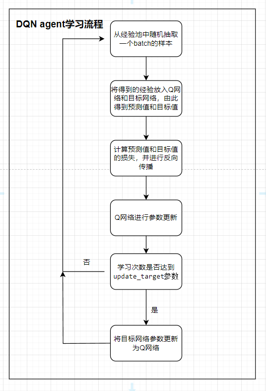

### 动作选择

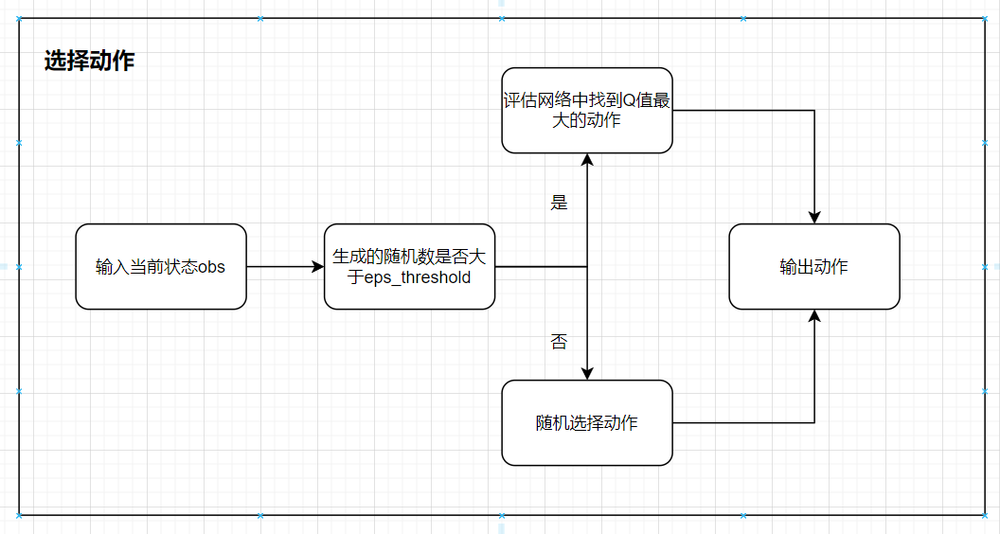

### 基本流程

以下为训练过程中的基本流程，按照此框架DQN agent进行训练

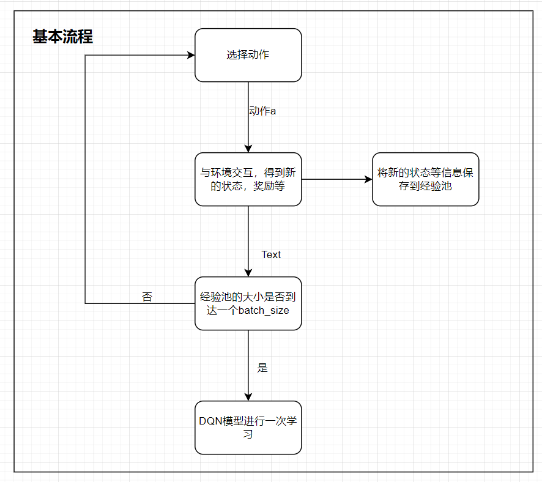

## 关键代码展示

###  神经网络

在DQN中用神经网络去近似价值函数

~~~python
#神经网络
class QNet(nn.Module):
    def __init__(self, input_size, hidden_size, output_size):
        super(QNet, self).__init__()
        self.fc1 = nn.Linear(input_size, hidden_size) #第一层全连接层
        self.fc2 = nn.Linear(hidden_size,hidden_size) #第二层全连接层
        self.fc3 = nn.Linear(hidden_size,output_size) #第三层全连接层
    def forward(self, x):
        x = torch.Tensor(x)
        x = F.relu(self.fc1(x))
        x = F.relu(self.fc2(x))
        return self.fc3(x)
~~~

### 经验回放

根据“流程图”中的网络模型结构构建出CNN模型

~~~python
class ReplayBuffer:
    def __init__(self, capacity):
        self.store = collections.deque(maxlen=capacity) #队列模拟经验池

    def len(self):
        return len(self.store) #返回经验池当前大小

    def push(self, *transition):
        self.store.append(transition) #存下一次transition
    def sample(self, batch_size): #随机采样一个batch
        transitions = random.sample(self.store,batch_size) # list,长度为batch_size
        obs, actions, rewards, next_obs, dones = zip(*transitions) #注意为一个batch
        return obs, actions, rewards, next_obs, dones

    def clean(self):
        self.store.clear() #清除经验池
~~~

### 动作选择

探索和利用同样重要，动作选择就是需要用合适的策略平衡两者，此处我使用的是一个动态的贪心策略。具体想法会在创新点中提到。

~~~ python
    def choose_action(self, obs):
        global steps_done
        sample = random.random()
        eps_threshold = self.eps_end + (self.eps_start - self.eps_end) * \
            math.exp(-1. * steps_done / self.eps_decay)
        steps_done += 1
        obs = torch.unsqueeze(torch.tensor(obs,device=device),dim=0) #转为tensor类型，并增加一维成[1,4]
        # 利用
        if sample > eps_threshold:
            with torch.no_grad():
                actions_value = self.eval_net(obs)
                action = actions_value.argmax().item()
        # 探索
        else:
            action = np.random.randint(low=0,high=2) #0 or 1
        return action
~~~

### DQN agent 学习

~~~python
    def learn(self):
        # [Update Target Network Periodically]
        if self.learn_step % args.update_target == 0:
            self.target_net.load_state_dict(self.eval_net.state_dict())
        self.learn_step += 1
        
        # [Sample Data From Experience Replay Buffer]
        obs, actions, rewards, next_obs, dones = self.buffer.sample(args.batch_size)
        actions = torch.LongTensor(actions).view(-1,1).to(device=device)  # to use 'gather' latter
        dones = torch.FloatTensor(dones).view(-1,1).to(device=device)
        rewards = torch.FloatTensor(rewards).view(-1,1).to(device=device)
        obs = torch.FloatTensor(np.array(obs)).to(device=device)
        next_obs = torch.FloatTensor(np.array(next_obs)).to(device=device)
        # [learn]
        q_eval = self.eval_net(obs).gather(1,actions) #预测值
        q_target = self.target_net(next_obs).max(1)[0].view(-1,1) #修改维度为[batch_size,1]
        td_target = rewards+self.gamma*(1-dones)*q_target #目标值
        self.optim.zero_grad()
        loss = self.loss_fn(q_eval,td_target) #计算损失
        loss.backward() #反向传播
        self.optim.step() #更新参数
~~~

## 创新点

**动态$\epsilon-greedy$策略 **: 在通常的DQN进行动作选择时，通常选择不带指数衰减的$\epsilon-greedy$策略，然而使用这种方式经过实际的实验发现，在训练初期可能无法充分探索，在训练后期可能仍然进行不必要的探索，无法充分利用已经学习到的结果。因此我想到使用动态$\epsilon-greedy$的策略，主要是添加了指数衰减，用数学公式表达即：
$$
\epsilon_{threshold} = \epsilon_{end}+(\epsilon_{start} - \epsilon_{end})*e^{-\frac{steps\_done}{\epsilon_{decay}}}
$$
整个公式结合起来的含义是：随着 `steps_done` 的增加，`eps_threshold` 从 `self.eps_start` 逐步衰减到 `self.eps_end`。具体来说，初始时 `steps_done` 较小，衰减因子接近于 1，`eps_threshold` 接近 `self.eps_start`；随着 `steps_done` 增加，衰减因子逐渐减小，`eps_threshold` 慢慢趋近 `self.eps_end`。

这个机制保证了算法在初期有较高的探索概率，以便充分探索环境中的各种可能性；而在后期逐渐减少探索，增加利用已经学习到的知识进行更有策略的行动选择。

用代码表示为：

~~~python
    def choose_action(self, obs):
        global steps_done
        sample = random.random()
        eps_threshold = self.eps_end + (self.eps_start - self.eps_end) * \
            math.exp(-1. * steps_done / self.eps_decay)
        steps_done += 1
        obs = torch.unsqueeze(torch.tensor(obs,device=device),dim=0) #转为tensor类型，并增加一维成[1,4]
        # 利用
        if sample > eps_threshold:
            with torch.no_grad():
                actions_value = self.eval_net(obs)
                action = actions_value.argmax().item()
        # 探索
        else:
            action = np.random.randint(low=0,high=2) #0 or 1
        return action
~~~

**更加合适的奖励**：gym给出的奖励只有0和1。当车的位置居中，棒子的角度也是几乎竖直的时候得到的奖励是1，当车的位移更靠近两端和棒子的倾斜角度已经比较大时得到的奖励仍然是1，这显然不太合理，正确的处理应该是让前者大于后者。所以这里我修改了奖励，但是在可视化的结果的时候仍然使用gym给出的奖励，不影响评测指标。

代码为：

~~~python
            # x 是车的水平位移, 所以 r1 是车越偏离中心, 分越少
            # theta 是棒子离垂直的角度, 角度越大, 越不垂直. 所以 r2 是棒越垂直, 分越高
            x, x_dot, theta, theta_dot = next_obs
            r1 = (env.x_threshold - abs(x)) / env.x_threshold - 0.8
            r2 = (env.theta_threshold_radians - abs(theta)) / env.theta_threshold_radians - 0.5
            new_r = r1 + r2 # 总 reward 是 r1 和 r2 的结合, 既考虑位置, 也考虑角度, 这样 DQN 学习更有效率
~~~

# 实验结果展示及分析

## 实验结果展示示例

实验结果主要包括“单局reward值”曲线和“最近百局的平均reward值”曲线，最高“最近百局的平均reward值”和“最近百局的平均reward值”首次得到475的时间。

* “单局reward值”曲线和“最近百局的平均reward值”曲线

​	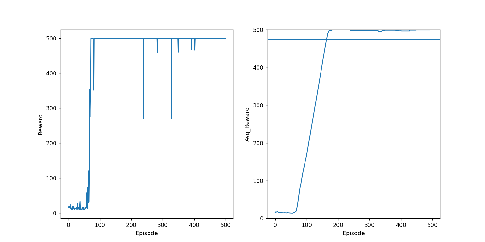

* 最高“最近百局的平均reward值”和“最近百局的平均reward值”首次得到475的时间

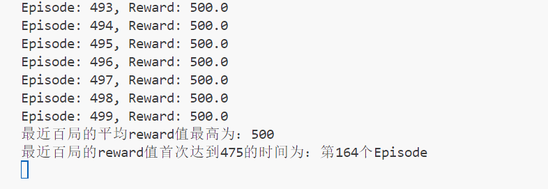

## 评测指标展示及分析

### 评测指标展示

* 静态$\epsilon-greedy$策略+普通reward值：

  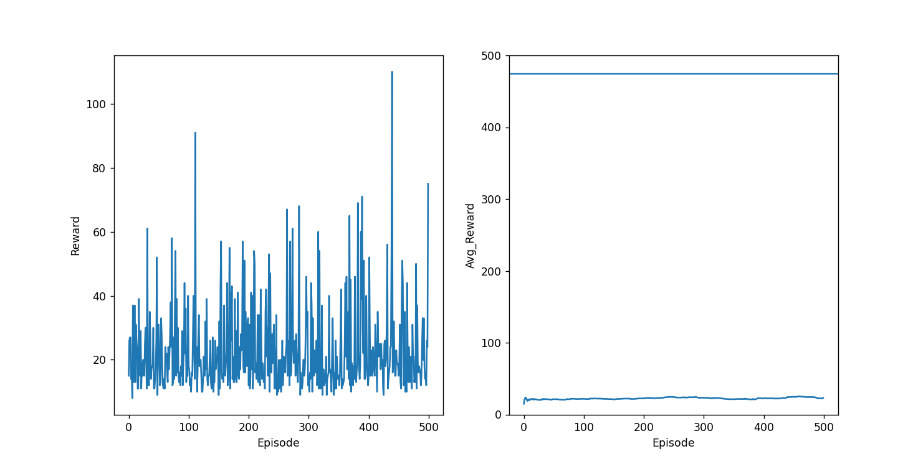

  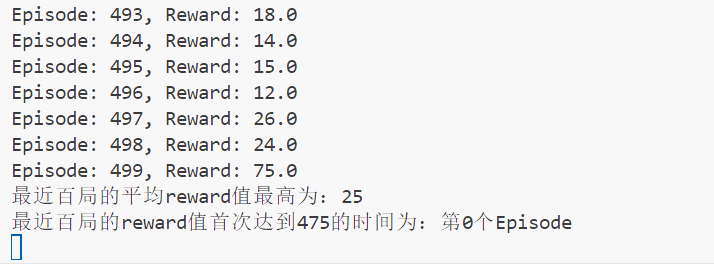

* 动态$\epsilon-greedy$​​策略+普通reward值：

  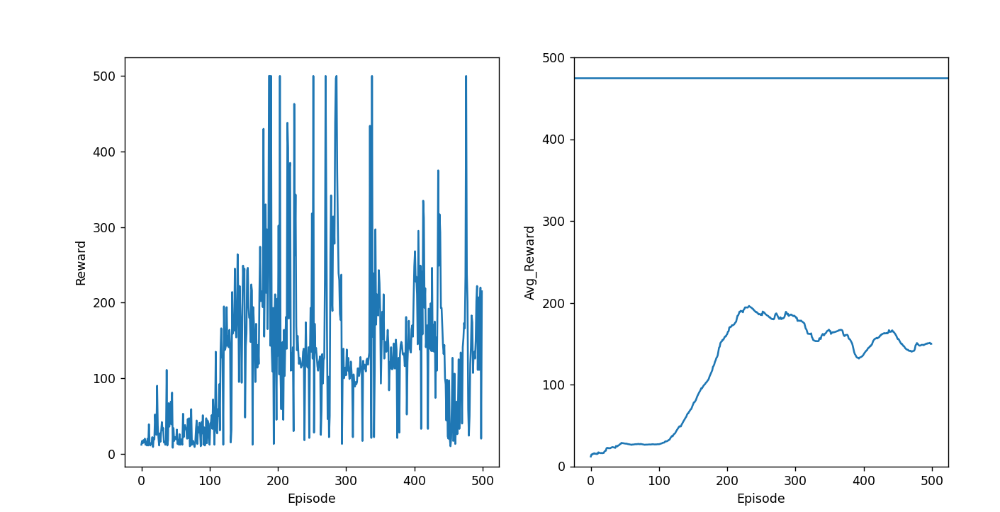

  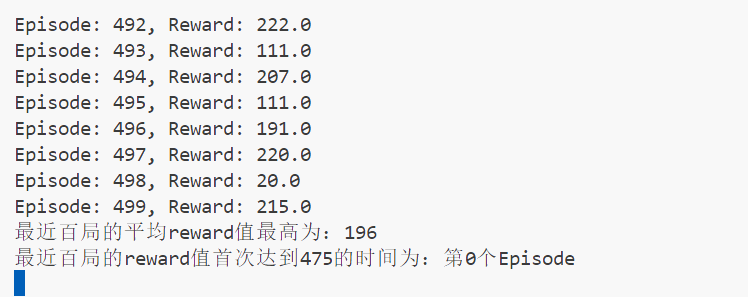

* 静态$\epsilon-greedy$​策略+创新reward值：

  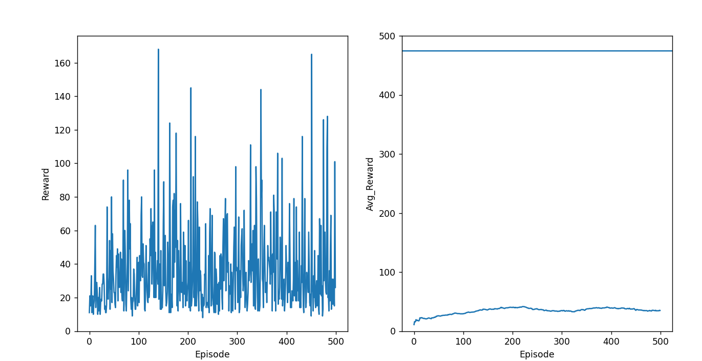

  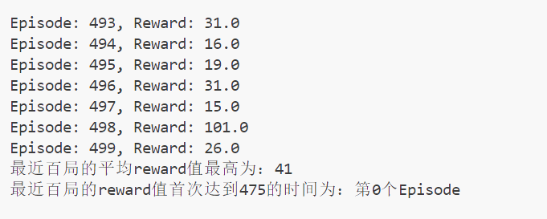

* **动态$\epsilon-greedy$策略+创新reward值（最优结果）**：

  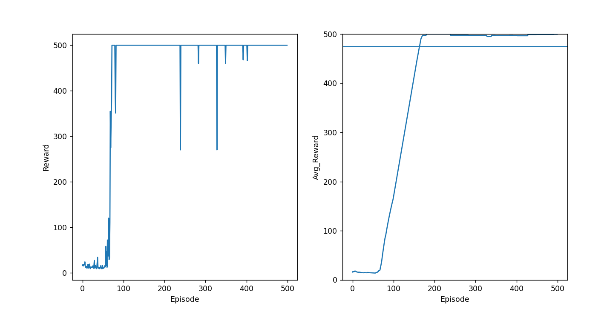

  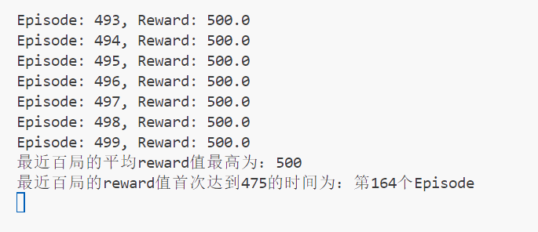

### 评测指标分析

可以看到动态的$\epsilon-greedy$策略和创新的reward值给DQN的学习能力带来了巨大的提升，在使用了这两个创新点之后，可以轻松达到“**连续十局reward值为500**”和“**最近百局的平均reward值大于475”**这两个要求，甚至可以**连续百局的reward值都为500**，并且达到实验要求的时间也非常快，在第**70**个Episode就可以达到500的reward，在第**164**个Episode时就已经达到实验要求。
